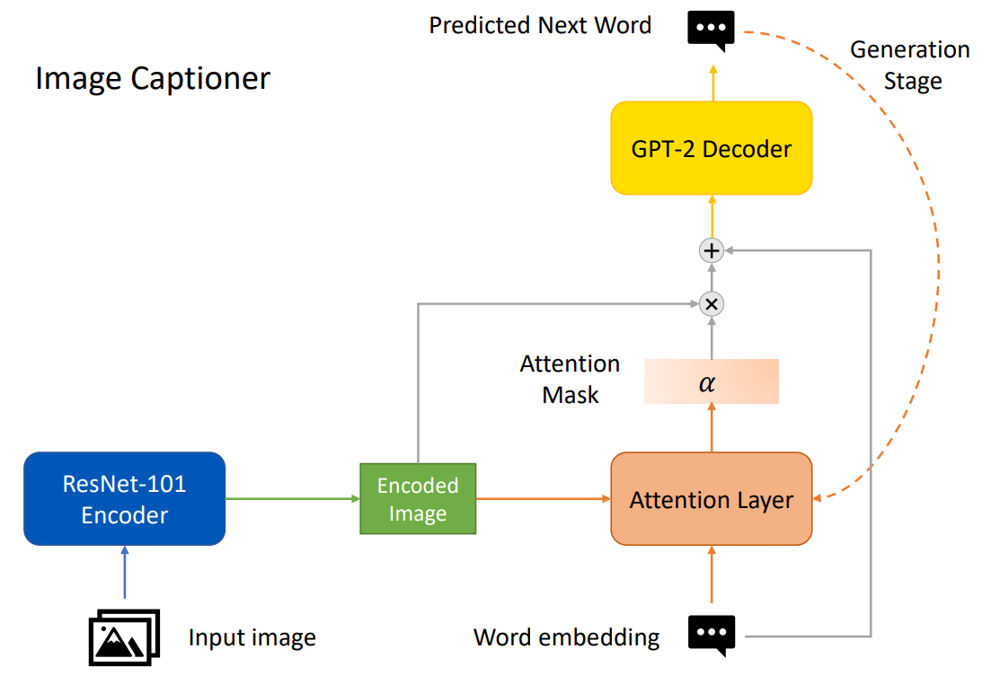
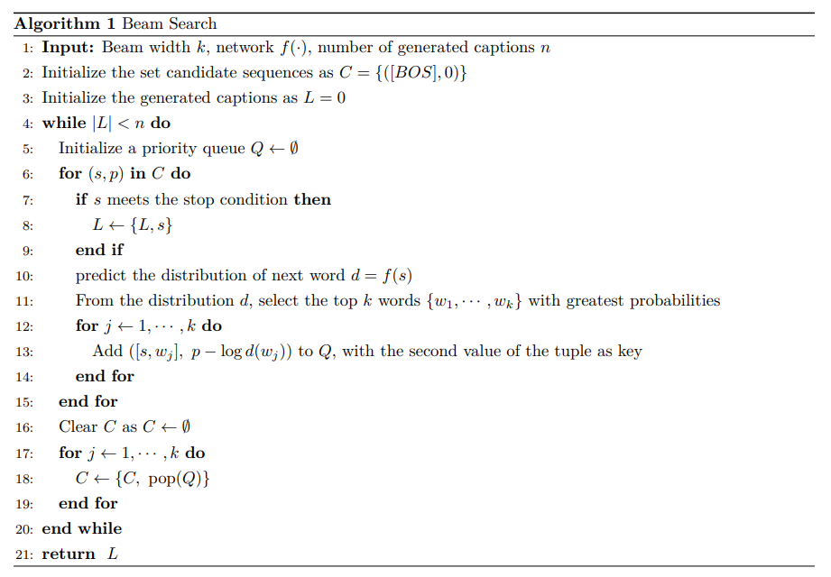

# GPT-ImageCaptioner
An automatic image captioner based on ResNet and GPT-2.

## Architecture
I implement an encoder-decoder model with attention. A pretrained ResNet-101 is selected as the encoder, and the Generative Pre-trained Transformer 2 (GPT-2) is selected as the decoder. To bind the generation of words together with the image features extracted by encoder, an attention layer is added to adjust the importance of different regions and features in encoded images according to the input word embeddings of decoder. A simplified structure chart of my architecture is shown below.



During training, the groundtruth captions are sequentially fed into the attention layer. In evaluation stage, where groundtruth captions are not accessible, the predicted word in the previous step was fed instead of groundtruth word. To select the predictive word, an immediate thought is the greedy strategy: since the seq2seq model outputs the scores of all words in its vocabulary, choose the word with the highest score (that is, the greatest probability). However, this strategy often fails to output the optimal sequence, because greedily choose the greatest probability (which is conditional) in each step does not necessarily produce the greatest joint probability. An improved strategy is beam search. Let k be a hyperparameter called beam width. At each decoding step, the top $k$ words with highest scores (that is, the $k$ greatest conditional probabilities) are chosen as candidate sequences for the next step. I implement this strategy when predicting captions. A detailed pseudocode is shown below.



## Environment
First you need to create a new conda environment and install PyTorch. To select the PyTorch verision which is compatible to your device, please refer to <https://pytorch.org/> for details. I use PyTorch 1.9.1 and torchvision 0.10.1 in my experiment.

```
conda create -n gptcap
conda activate gptcap
```

Then you need to install some necessary libraries.
```
pip install -r requirements.txt
```
You also need to install the COCO API to load the data. Please refer to <https://github.com/cocodataset/cocoapi> for details.

## Dataset
Please download the MSCOCO 2014 dataset (images and annotations) to directory ```./data```. MSCOCO dataset is pubilcly accessible via <https://cocodataset.org/#download>. Make sure your files are organized as below.
```
./data/
./data/annotations/
./data/annotations/captions_train2014.json
./data/annotations/captions_val2014.json
./data/train2014/
./data/val2014/
./data/test2014/
```

## Training
To train a image captioning model, please run the following command. 
```
python train.py
```
For evaluation, run this command.
```
python eval.py
```
